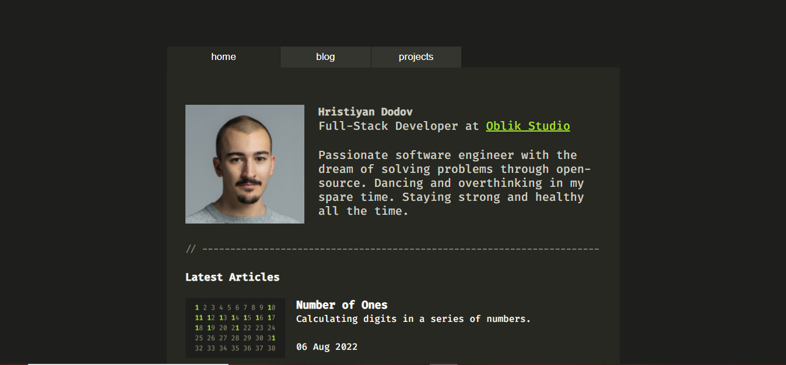
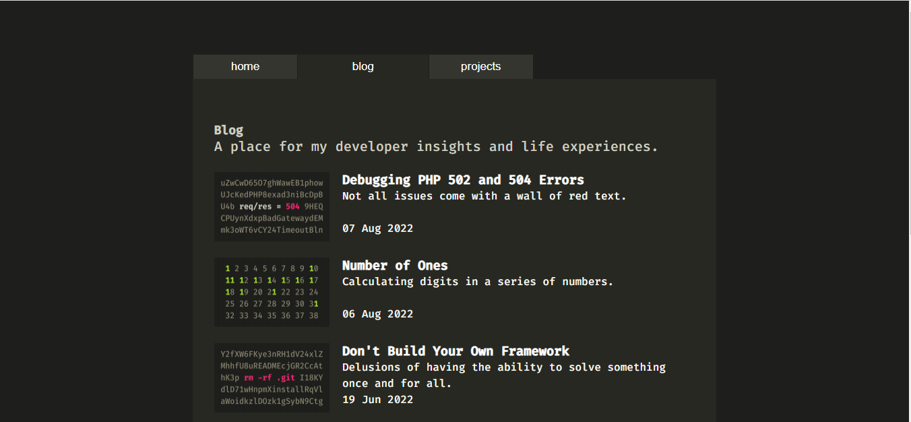
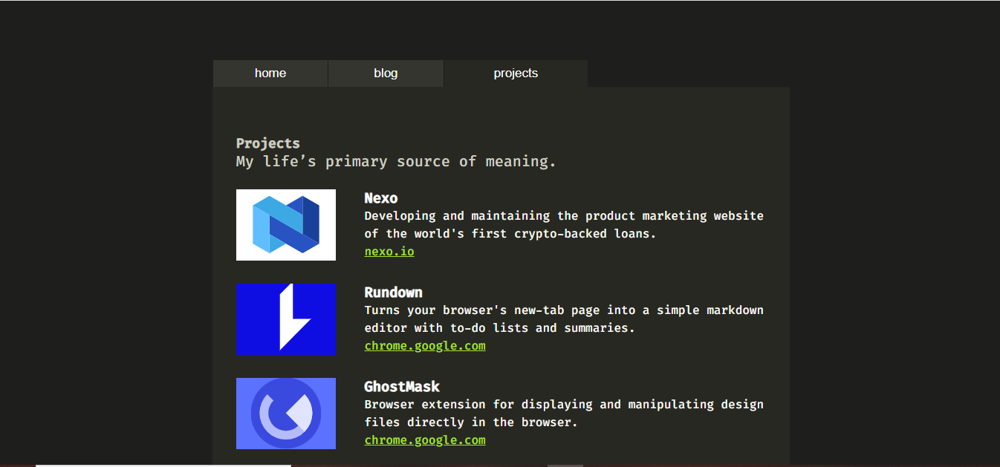

# DODOV RECREATION

### Description
This is a recreation of the [DODOV](https://dodov.dev/) website 

### url
 Check out my own creation [dodov](https://solex55.github.io/dodov/ "dodov")

 ### Screenshots
 These are screenshot of the site:

 *  #### The home page
    

 *  #### The blog page
    

 *  #### The projects page
     


 I also learnt to use some cool css properties
 ```css
container {
    display: flex;
    flex-flow: column nowrap;
    width: 100%;
    max-width: 81ch;
    margin: 0 auto;
    overflow: hidden;
}
 ````


 Materials i used for the creation
 1. Youtube
 2. Google fonts
 3. Geeksforgeeks
 4. W3 schools
 5. Inspect (just a little)
